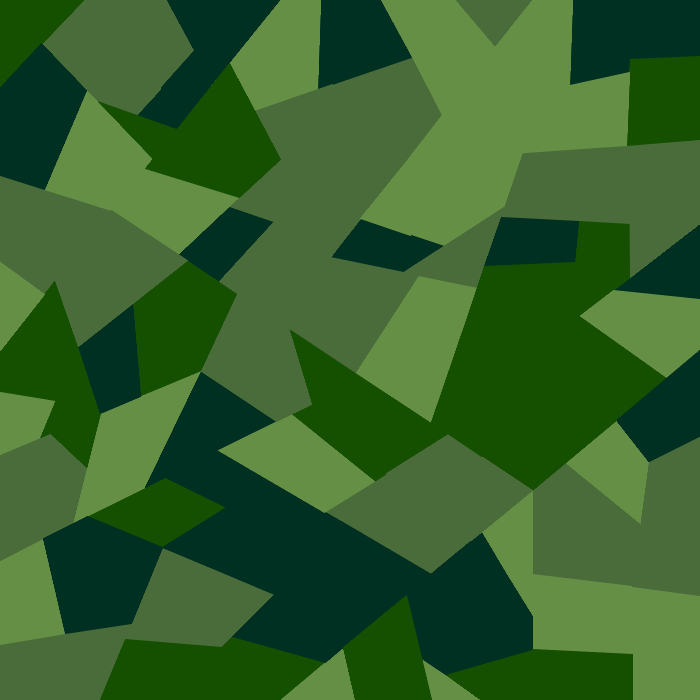
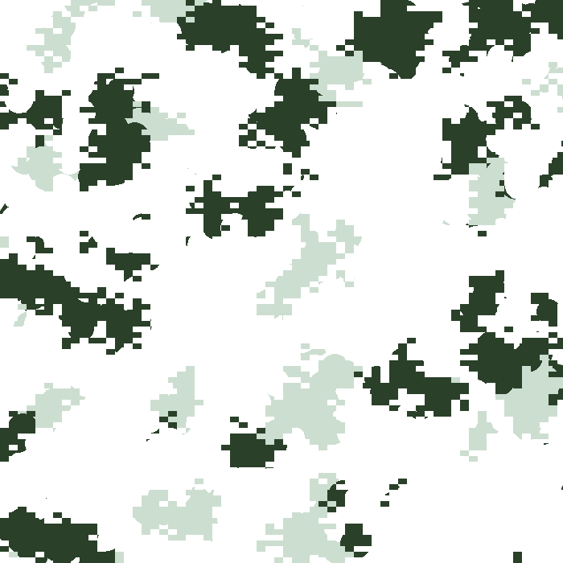

# 🦎 camogen for PHP

**camogen for PHP** is a procedural random camouflage pattern generator.

This code is a PHP port of the [camogen](https://github.com/glederrey/camogen) application written in Python by Gael Lederrey, which is itself a port of the original camogen PHP web app by Ulf Åström, previously available at [http://www.happyponyland.net/camogen.php](http://www.happyponyland.net/camogen.php) (site currently down).

Using this application you can create unique camouflage patterns that are built up from a number of different drawing routines and processing effects. It is particularly suitable for generating digital camouflage, "dazzle" patterns, and other experimental designs.

The output from this code has been tested for accuracy against the output from the camogen Python application and should generate identical images given the same starting parameters. However, any mistakes or inaccuracies in this implementation are solely my own.

Many thanks to Gael Lederrey and Ulf Åström for their work on **camogen**. This project would not have been possible without their efforts!

The first release of this code has been codenamed **_Stealthy Salamander_**. To find out more about salamanders and support their conservation please visit the [Foundation for the Conservation of Salamanders](https://www.fcsal.org/) web site.

## System requirements

PHP 5.4+ with Imagick or GD extensions

## How to use

The following scripts can be used to generate the example image set shown below:

- `camogen-examples-cli.php`
  - Command line script to generate and save the example images
- `camogen-examples-browser.php`
  - Browser-based script to generate and save the example images, then display them in your browser

Please see the comments at the top of each script for more details on how to run them.

## Examples

#### Green Blots

#### Mighty Swede

#### Vodka

#### Maple Warrior

#### Desert

#### Desert 2

#### Klosterschwester

#### Blue Sky

#### Canopy

#### Violet Rain

#### German Super Dog 2

##### (Imagick extension)

#### Stealthy Salamander

##### (Imagick extension)

## Example clothing applications

## Imagick/GD

Anti-aliasing is enabled by default except for post-processed images that use the rain effect; the reason for this is that GD does not apply line thickness settings on certain drawing tools when anti-aliasing is enabled.

The code will attempt to use the GD extension if it is available, or the Imagick extension if the GD extension is not available; if neither is available then the script will exit with an error message. The Imagick extension is recommended for best quality and additional processing effects (currently, motion blur), while GD is recommended for faster performance or if you intend to batch-process complex images with a separate application. As an exercise left to the user, the `Image_Generator` class has been designed to be extensible and other image library extensions could be supported provided that they provide the same basic drawing routines as Imagick and GD.

By default, Imagick outputs images at 72dpi and GD outputs images at 96dpi.

### Imagick issues

Using Imagick may significantly increase script execution times depending on your exact server configuration and pattern design. If it's taking an excessively long time to generate images, please try using GD instead.

### GD issues

The motion blur effect is not supported with GD as this effect is not easily attainable using the limited set of filters available. If you specify any settings for this effect in the parameters they will be ignored.

Anti-aliasing may not be available in some PHP installations < 7.1 because the `imageantialias()` function is only available if PHP has been compiled with the bundled version of the GD library.

## PHP version compatibility
- Development PHP version: PHP 7.4.33 with Imagick and GD extensions
- Minimum PHP version tested: PHP 5.4.45 with GD extension
- Maximum PHP version tested: PHP 8.2.0 with GD extension

**camogen for PHP** has been written to be compatible with as many versions of PHP as possible. If you are not able to run this code on your version of PHP please raise an issue on GitHub, specifying your exact PHP version, whether you are using GD and/or Imagick, and what error messages (if any) you receive.

## Contact

If you have any questions about the code or suggestions to improve it please submit an issue or create a new topic in the Discussions section. You can also email me here: [info@camogen-php.com](mailto:info@camogen-php.com)
